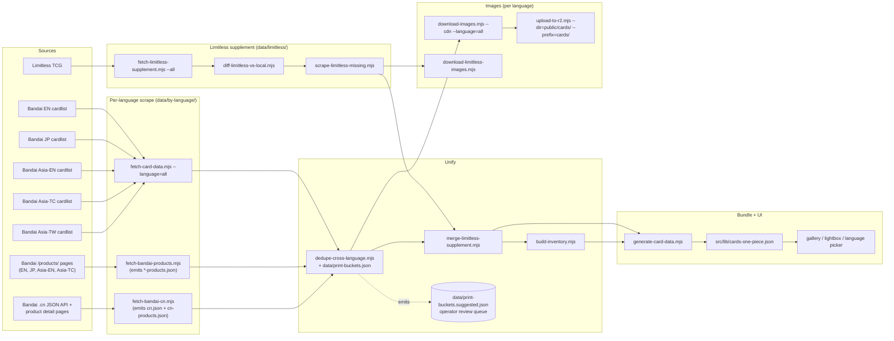

# One Piece TCG — Data Pipeline

This is the operator manual for the One Piece card pipeline. It documents
**every source we pull from**, **every script that runs**, **what each one
produces**, and **the exact commands to refresh the catalogue from scratch
or incrementally**.

Keep this file in sync with `scripts/*.mjs` when you change a source,
add a language, or rename an artifact. The pipeline scripts deliberately
read this layout (file names, directory names) and break loudly when it
drifts.

---

## 1. Sources

We pull from **four classes of source**: Bandai's first-party regional
cardlist sites (authoritative for everything they cover), Bandai's
per-region product showcase pages (where anniversary / premium / limited
prints actually live), the Bandai `.cn` JSON API (Simplified-Chinese
catalogue + product detail pages), and Limitless TCG (community catalog
used as a supplement for the long tail of off-catalog promos and stamped
reprints).

### 1.1 Bandai regional cardlists

Every Bandai region serves the same HTML cardlist structure under
`/cardlist/`. The only differences are the host, the displayed
language, and which series each region has actually shipped yet.

| Region    | Host                              | `CardLanguage` tag | What it covers                                                                                       |
| --------- | --------------------------------- | ------------------ | ---------------------------------------------------------------------------------------------------- |
| EN        | `en.onepiece-cardgame.com`        | `EN`               | NA / EU English. Lags JP by ~6 months but is the canonical store of EN names + rules text.           |
| JP        | `www.onepiece-cardgame.com`       | `JP`               | The master Japanese catalogue. **Always** has the largest print count and ships first.               |
| Asia‑EN   | `asia-en.onepiece-cardgame.com`   | `EN_ASIA`          | English-language Asia distribution. Almost identical to EN but ships in parallel with JP timing.     |
| Asia‑TC   | `asia-tc.onepiece-cardgame.com`   | `TC`               | Traditional Chinese (Hong Kong / Macau distribution).                                                |
| Asia‑TW   | `asia-tw.onepiece-cardgame.com`   | `TW`               | Traditional Chinese (Taiwan distribution).                                                           |
| CN (SC)   | `onepiece-cardgame.cn` / `onepieceserve.windoent.com` | `SC` | Simplified-Chinese (Mainland China) — Vue SPA backed by a JSON API. Distinct first-party catalogue, distinct image CDN (`source.windoent.com`). |

Coverage gaps to know about:

- The Asia‑TC and Asia‑TW sites occasionally serve a **JP-art placeholder
  watermarked `SAMPLE`** for cards they haven't translated yet (typical for
  the older OP01–OP03 boosters). This is upstream behaviour — our pipeline
  records the URL faithfully and the UI shows what Bandai serves.
- Bandai's `asia-tw` site **silently ignores POST data** for series
  filtering. The scraper works around this by using GET requests with
  `?series=…` query strings universally across every region.
- Bandai publishes Korean at `onepiece-cardgame.kr` and Thai at
  `onepiece-cardgame.com.th`. Both are **out of scope** for Phase 7/8
  (Korean uses a totally different `OPK-XX` ID scheme; Thai is
  reachable but no user has asked for it). Plumbing them in later is
  ~1 day of work — add a `REGIONS` entry in `fetch-card-data.mjs`,
  a new `CardLanguage` enum value in `src/lib/types.ts`, and a
  picker bucket in `LANGUAGE_GROUPS`.

### 1.2 Bandai product showcase pages (Phase 8)

The regional cardlist DBs **do not list anniversary / premium / limited
prints** — those live exclusively on per-product showcase pages under
each region's `/products/`. Examples:

- `https://en.onepiece-cardgame.com/products/other/1st-anniversary-set/`
- `https://asia-tc.onepiece-cardgame.com/products/other/anniversaryset1st.php`
- `https://www.onepiece-cardgame.com/products/special_set/<slug>.html`

`scripts/fetch-bandai-products.mjs` walks the listing index
(`/products/?subcategory=others`), follows every product page, and
extracts every `` whose filename matches the `OPxx-NNN` card-id
pattern. The product page's `<title>` becomes the `distribution`
string the deduper uses to bucket prints across regions (e.g. an EN
"1st Anniversary Set" page and the SC "一周年纪念套装" product detail both
normalize to `anniv-1`).

Cross-region quirks:

- `asia-tw` has no distinct product catalogue — its `/products/` page
  links straight to `asia-tc.onepiece-cardgame.com` content. We
  deliberately skip those cross-origin links so `asia-tw-products.json`
  ends up empty; `asia-tc` covers the same prints and they get unified
  by the deduper.
- JP product pages occasionally include `※画像はイメージです...` disclaimer
  text in the breadcrumb. We strip it via title-tag preference + a
  scoped breadcrumb parser; if you see disclaimer noise leaking into a
  new `distribution` string, that's the place to fix.
- Card-id normalization: 2-digit collector numbers (`OP14-69`) are
  zero-padded to 3 digits (`OP14-069`) so they merge with the
  canonical cardlist row.

### 1.3 Bandai `.cn` JSON API (Phase 8)

Simplified-Chinese coverage is first-party but undocumented. The Vue
SPA at `onepiece-cardgame.cn` is backed by a JSON API at
`https://onepieceserve.windoent.com/onepiece/`:

| Endpoint                                         | Use                                                                                     |
| ------------------------------------------------ | --------------------------------------------------------------------------------------- |
| `cardList/cardlist/weblist?pageNo=N&pageSize=20` | Paginated catalogue — the primary card feed (full cards + image URLs + `cardNumber`).   |
| `products/productslist/weblist?pageNo=...`       | Product catalogue (anniversary sets, premium collections, limiteds).                    |
| `products/productsinfo/webInfo/<id>`             | Per-product detail. Older products use a structured `titleModel[]`; newer products bury card lists inside HTML blobs (`detailContent` / `detailRemark`) that we regex-extract. |

CN id normalization (`scripts/fetch-bandai-cn.mjs::normalizeCnId`) is
load-bearing — the .cn site uses several CN-only conventions:

- Underscore separator: `OP06_118_SEC` → `OP06-118` (rarity overlay stripped).
- Variant numbering: `OP14-107_01` → `OP14-107_p1` (the .cn site uses
  `_0N` where every other region uses `_pN`).
- Rarity overlay suffixes (collapsed onto the underlying print, **not**
  treated as variants): `S`, `SP`, `SR`, `SEC`, `R`, `CP`, `LP`, `PR`,
  `P`, `P-R`, `P-D`, `P-SR`, `P-SEC`, `_D`.
- Product-page extracts get a synthetic `_p9NN` suffix tied to the
  product id (e.g. `OP01-016_p940` = product `40`'s extract of
  `OP01-016`). This forces the deduper to treat them as variants and
  bucket them by `distribution` rather than collapsing into the base.

Images live on `source.windoent.com` and are allow-listed in
`next.config.js::remotePatterns`. The pipeline records the raw CDN URL
in `imagesByLanguage.SC` and the UI swaps it in when the CN picker is
active; no R2 mirror yet (see "Known limitations").

### 1.4 Limitless TCG (supplement)

`https://onepiece.limitlesstcg.com` is the de-facto community catalog.
It tracks everything Bandai publishes **plus** the long tail of promo
products Bandai forgets to add to `/cardlist/`:

- Illustration Box vols
- Premium Card Collections
- Championship celebration packs (Champion / Winner / Event stamps)
- Tournament prize cards
- Pre-release packs
- Magazine inserts

We treat Limitless as a **supplement, never a replacement**. When a
print exists in any Bandai region, Bandai's data wins (gameplay text,
images, name). Limitless only contributes prints Bandai doesn't list.

Politeness budget: 200 ms between requests, single-threaded. A full
crawl is ~17 min and is resumable (each category writes to disk
before moving on).

---

## 2. Pipeline DAG



---

## 3. Scripts (alphabetised)

Each script is **idempotent** and **safe to re-run**. Output paths
double as cache keys: re-running a step overwrites its artifacts
atomically (writes to `.tmp`, rotates to `.bak`, renames into place).

| Script                                  | Reads                                                              | Writes                                                                              | Notes                                                                                                              |
| --------------------------------------- | ------------------------------------------------------------------ | ----------------------------------------------------------------------------------- | ------------------------------------------------------------------------------------------------------------------ |
| `scan-for-new-cards.mjs`                | Every fetcher's output + `src/lib/cards-one-piece.json`            | `data/scan-report.{json,md}`                                                        | The "what's new across every source" orchestrator (npm: `cards:scan`). Read-only relative to the bundle. `--full` also runs the Limitless detail crawl. `--skip-{bandai,cn,products,limitless}` to narrow. |
| `fetch-card-data.mjs`                   | Bandai region site HTML                                            | `data/by-language/<lang>.json`                                                      | `--language=` selects region; `--language=all` sweeps every region; `--language=legacy` keeps the old EN+JP merge. |
| `fetch-bandai-products.mjs` *(Phase 8)* | Bandai `/products/` listing + per-product HTML for every region    | `data/by-language/<region>-products.json`                                           | Synthetic rows tagged with the product label so the deduper can bucket by `distribution`. `asia-tw-products.json` is intentionally empty (no distinct catalogue). |
| `fetch-bandai-cn.mjs` *(Phase 8)*       | `onepieceserve.windoent.com/onepiece/cardList/...` + `products/productsinfo/webInfo/<id>` | `data/by-language/cn.json` + `data/by-language/cn-products.json`         | Normalizes `_0N`→`_pN`; strips rarity overlays (`SP`/`P-R`/`P-SR`/…). Product extracts get a synthetic `_p9NN` suffix tied to the product id so they bucket as variants. |
| `fetch-limitless-supplement.mjs`        | Limitless category pages                                           | `data/limitless/{categories,card-urls}.json`                                        | `--crawl` discovers; `--details` per-card; `--all` runs both.                                                      |
| `diff-limitless-vs-local.mjs`           | `data/limitless/card-urls.json`, every `data/by-language/*.json`   | `data/limitless/{missing-bases,missing-variants,known}.json`                        | Unions every Bandai region so "missing" really means missing everywhere.                                           |
| `scrape-limitless-missing.mjs`          | `data/limitless/missing-variants.json`                             | `data/limitless/missing-variants-detailed.json`                                     | Fetches full metadata (artist, product, subtitle, stamp keywords) for each row.                                    |
| `dedupe-cross-language.mjs`             | `data/by-language/*.json`, `data/by-language/*-products.json`, `data/by-language/cn*.json`, `data/limitless/missing-variants-detailed.json`, `data/print-buckets.json` *(optional)* | `data/cards.json` (.bak rotated) + `data/print-buckets.suggested.json` | Region-scoped print keys + distribution-string bucket matcher. Emits `imagesByLanguage` / `namesByLanguage` / `languages` / `exclusiveTo` / `regionalIds`. Splits region-local `_pN` collisions and tags survivors with `_pN_<lang>` when they can't be merged. |
| `merge-limitless-supplement.mjs`        | `data/cards.json`, `data/limitless/missing-variants-detailed.json` | `data/cards.json` (in place)                                                       | Injects Limitless-only prints with `source='limitless'` and classifies stamps (`winner`/`event`/`champion`/etc.).  |
| `build-inventory.mjs`                   | `data/by-language/*.json`, `data/cards.json`, `public/cards/**`     | `data/inventory.json`                                                              | Per-language card counts + per-print image hashes; the cache that lets weekly re-runs do delta-only work.          |
| `download-images.mjs`                   | `data/by-language/<lang>.json`                                      | `public/cards/<lang>/<printId>.png` (EN goes to flat `public/cards/<printId>.png`) | `--cdn --language=all` sweeps every region; `--zip` is an EN-only fast path.                                       |
| `download-limitless-images.mjs`         | `data/limitless/missing-variants-detailed.json`                     | `public/cards/<printId>.png`                                                       | Converts Limitless WebP → PNG on disk.                                                                             |
| `upload-to-r2.mjs`                      | `public/cards/<lang>/`                                              | `r2://<bucket>/cards/<lang>/<printId>.png` + `data/uploaded-<prefix-slug>.json`     | Skips files already in the marker; concurrent uploads.                                                             |
| `generate-card-data.mjs`                | `data/cards.json`, `data/packs.json`                                | `src/lib/cards-one-piece.json`, `src/lib/sets-one-piece.json`                      | Collapses per-print rows into `Card.variants[]` + `Card.imagesByLanguage` + `Card.regionalIds`; emits R2 URLs for EN, raw Bandai URLs for non-EN and for collision-suffixed ids (`_pN_<lang>`, `_lN`) until we mirror them. |

---

## 4. The refresh playbook

### 4.0 "What's new since last sweep?" (~7 min, read-only)

This is the **manual maintenance command**. Run it whenever you want to
know whether anything new has dropped across any source — Bandai
boosters, tournament prize packs, Premium Bandai limited boxes,
Mainland anniversary sets, magazine inserts, championship prizes.
It hits every source we know about, diffs against the shipping bundle
in `src/lib/cards-one-piece.json`, and prints a categorized report of
**net-new print ids the bundle doesn't have yet**.

```bash
npm run cards:scan                 # ~7 min: every source, quick mode
npm run cards:scan:full            # +~17 min: also full Limitless detail crawl
node scripts/scan-for-new-cards.mjs --skip-limitless   # narrow the run
```

Cadence: once a week is plenty. Bandai drops a new product or
Limitless catalogues a new tournament pack roughly monthly; the
serialized / anniversary one-offs (the high-heat stuff) trickle in
two or three at a time. The scan is the dragnet that catches them.

Outputs:

- Stdout: short summary table per source + sample of the first 8 new
  prints from each (good for chat / quick triage).
- `data/scan-report.json`: full machine-readable list of every new
  print id, partitioned by source, with categories for Limitless
  (championship prizes vs. anniversary boxes vs. promo packs etc.).
- `data/scan-report.md`: same data as GitHub-flavored markdown, paste
  into an issue or chat thread.

The scan **writes nothing to the bundle**. It surfaces findings; the
operator (you or the agent) decides what to ingest. To actually pull
a print into the bundle, follow the §4.1 or §4.2 playbook focused on
the relevant source.

### 4.1 Daily / on-demand (~15 min, no image downloads)

Use when you just want fresh **catalogue metadata** (new printings,
renamed products, fixed text) and don't care whether new image bytes
made it onto R2 yet.

```bash
node scripts/fetch-card-data.mjs --language=all          # ~4 min, polite cardlist scrape
node scripts/fetch-bandai-products.mjs                   # ~2 min, /products/ pages for all 4 regions
node scripts/fetch-bandai-cn.mjs                         # ~2 min, .cn cardlist + product detail pages
node scripts/dedupe-cross-language.mjs                   # ~1s, also writes data/print-buckets.suggested.json
node scripts/merge-limitless-supplement.mjs              # ~1s, idempotent
node scripts/build-inventory.mjs                         # ~5s, refreshes inventory.json
node scripts/generate-card-data.mjs                      # ~1s, rebuilds the UI bundle
```

The UI picks up the new bundle on the next dev / production build.
Cards introduced by this pass render their **Bandai source URL**
directly until a separate image-mirror sweep runs (next section).

After the dedupe step **scan the diff in `data/print-buckets.suggested.json`**
— see [§5 Print buckets contract](#5-print-buckets-contract-dataprint-bucketsjson)
for the operator workflow. New cross-region promo sets (Bandai ships one
every few months) usually need a one-line entry in
`data/print-buckets.json` to merge their per-region prints into a single
canonical row.

### 4.2 Weekly / on new-product release (~45 min, full mirror)

When Bandai drops a new booster (or a Limitless category lands a
batch of stamped prints), run the full sequence:

```bash
# 1. Re-scrape every Bandai region (cardlist + product pages + .cn API)
node scripts/fetch-card-data.mjs --language=all
node scripts/fetch-bandai-products.mjs
node scripts/fetch-bandai-cn.mjs

# 2. Refresh the Limitless inventory and find new gaps
node scripts/fetch-limitless-supplement.mjs --all
node scripts/diff-limitless-vs-local.mjs
node scripts/scrape-limitless-missing.mjs

# 3. Rebuild the unified catalogue
node scripts/dedupe-cross-language.mjs
#    → review data/print-buckets.suggested.json now (see §5)
#    → if you promote any auto-matches, re-run the dedupe step.
node scripts/merge-limitless-supplement.mjs

# 4. Mirror images (per-language, throttled to 2 req/s)
node scripts/download-images.mjs --cdn --language=all
node scripts/download-limitless-images.mjs

# 5. Push images to R2 (incremental; skips already-uploaded files
#    via data/uploaded-*.json markers)
node scripts/upload-to-r2.mjs                                       # EN root
node scripts/upload-to-r2.mjs --dir=public/cards/jp      --prefix=cards/jp
node scripts/upload-to-r2.mjs --dir=public/cards/asia-en --prefix=cards/asia-en
node scripts/upload-to-r2.mjs --dir=public/cards/tc      --prefix=cards/tc
node scripts/upload-to-r2.mjs --dir=public/cards/tw      --prefix=cards/tw
node scripts/upload-to-r2.mjs --dir=public/cards/sc      --prefix=cards/sc  # once SC is staged locally

# 6. Refresh inventory + regenerate the bundle
node scripts/build-inventory.mjs
node scripts/generate-card-data.mjs
```

On a clean run nothing in step 4 / 5 downloads or re-uploads anything
that didn't change — `data/inventory.json` (image hashes) and
`data/uploaded-*.json` (R2 marker files) carry the previous state
forward.

### 4.3 First-time bootstrap (~2 h)

Same as 4.2 but with an empty `data/inventory.json`. Step 4 is the
long pole — five regions × ~4500 cards × 500 ms / req ≈ 90 min for
the polite Bandai sweep. Run it overnight.

---

## 5. Print buckets contract (`data/print-buckets.json`)

Bandai's per-region `_pN` suffixes are **not canonical across regions**.
The same string `OP01-016_p7` means three different prints depending on
which cardlist site you load it from:

| Region    | What `OP01-016_p7` is on this site            |
| --------- | --------------------------------------------- |
| EN        | 1st Anniversary Set Nami                      |
| JP        | PRB-01 ("ONE PIECE CARD THE BEST") Nami       |
| Asia‑TC   | PRB-01 Nami (same art as JP)                  |

`dedupe-cross-language.mjs` handles this by **bucketing every row by a
normalized version of its `distribution` string** (the product label
from the cardlist DB or the product showcase page). Rows that fall in
the same bucket merge into one canonical print with multi-region
`imagesByLanguage` + `regionalIds`. Rows that don't match any bucket
become region-specific prints disambiguated with a `_pN_<lang>`
suffix (e.g. `OP01-016_p5_jp`).

### Auto-suggestions

After every run, the deduper writes
`data/print-buckets.suggested.json` listing every base id with **two or
more single-region buckets** — i.e. candidates that might be the same
cross-region promo set that just aren't matching by string yet. Shape:

```jsonc
{
  "EB01-007": [
    {
      "bucketKey":   "EB01-007::premium-other",
      "canonicalId": "EB01-007_p1_jp",
      "languages":   ["JP"],
      "members": [
        { "rowKey": "JP:EB01-007_p1", "distribution": "プレミアムカードコレクション - ベストセレクション vol.4 -" }
      ]
    },
    {
      "bucketKey":   "EB01-007::nodist-p2",
      "canonicalId": "EB01-007_p2",
      "languages":   ["SC"],
      "members": [
        { "rowKey": "SC:EB01-007_p2", "distribution": "宣传卡" }
      ]
    }
  ]
}
```

Each entry is one *unmerged* single-region bucket. When two buckets in
the same array obviously describe the same product (translate the
labels with whatever you've got handy — Google Translate is fine for
the spot-check), they should be merged via `print-buckets.json`.

### Operator review workflow

1. Open `data/print-buckets.suggested.json` after `dedupe-cross-language.mjs`.
2. For each base id, decide whether the listed buckets really are the
   same cross-region print. (Useful tells: same artwork on the Bandai
   site, same `OP01-016_pN` suffix in every region, same product
   keywords once you ignore EN ↔︎ TC translation differences.)
3. When two buckets should merge, add an entry to
   `data/print-buckets.json` (hand-maintained, *flat map of
   bucketKey → array of `"<LANG>:<printId>"` rowKeys*):

   ```jsonc
   {
     "OP01-016::premium-girls": [
       "EN:OP01-016_p5",
       "EN_ASIA:OP01-016_p5",
       "TC:OP01-016_p5",
       "TW:OP01-016_p5"
     ]
   }
   ```

   The `bucketKey` is freeform; we use the
   `<baseId>::<short-description>` convention so the file is
   greppable. Every row in `members[].rowKey` from the
   suggestions file goes verbatim into the array.

4. Re-run `dedupe-cross-language.mjs`. Pinned rowKeys win over the
   automatic distribution-string normalizer, so the merge is locked
   in. Look for `loaded N override pins from print-buckets.json (M
   buckets)` in the log to confirm the file parsed.
5. Commit `data/print-buckets.json` alongside `data/cards.json`. The
   suggestions file is regenerated every run — treat it as a diff
   artifact, not a long-lived source of truth.

In practice this file rarely needs changes (only when Bandai ships a
new cross-region promo, ~monthly). The auto-bucketer already handles
the standard cases: `1st-anniversary` / `Nth-anniversary`, `PRB-01`,
`Premium Card Collection -XYZ-`, magazine inserts, generic
`promo:<slug>` strings, and Chinese number-word anniversaries
(`一周年` → `anniv-1`, `三周年` → `anniv-3`).

---

## 6. Inventory contract (`data/inventory.json`)

`build-inventory.mjs` is the only writer; every other script may
**read** it to decide what to skip on the next pass. The shape is
deliberately small so that diff-friendly tools (`git diff`,
`jq`, code review) can spot real changes at a glance.

```jsonc
{
  "lastRunAt": "2026-05-21T13:40:56.721Z",
  "byLanguage": {
    "EN":      { "cards": 4371, "lastBandaiSync": "..." },
    "JP":      { "cards": 4518, "lastBandaiSync": "..." },
    "EN_ASIA": { "cards": 4470, "lastBandaiSync": "..." },
    "TC":      { "cards": 4471, "lastBandaiSync": "..." },
    "TW":      { "cards": 4471, "lastBandaiSync": "..." },
    "SC":      { "cards": 2683, "lastBandaiSync": "..." }
  },
  "byPrintId": {
    "OP05-062_p1": {
      "languages":   ["EN_ASIA", "TC", "TW"],
      "imageHashes": { "EN_ASIA": "sha256:…", "TC": "sha256:…", "TW": "sha256:…" },
      "imageBytes":  { "EN_ASIA": 312843,      "TC": 309541,      "TW": 308912    },
      "source":      "bandai",
      "stamp":       null,
      "lastSeenAt":  "2026-05-21T13:40:56.787Z"
    }
  }
}
```

Field semantics:

- **`byLanguage[lang].cards`** — number of rows in `data/by-language/<lang>.json`. The fetch script's diff report compares this against the new pull and refuses to overwrite when the new pull shrinks by >20% (`MIN_RETENTION_RATIO` in `fetch-card-data.mjs`).
- **`byPrintId[id].languages`** — every region that lists this print after dedupe. Drives the UI's `Card.languages` field.
- **`byPrintId[id].imageHashes[lang]`** — SHA-256 of the bytes we have on disk for that language. The download / upload scripts skip re-fetching and re-uploading when the hash matches the upstream byte stream.
- **`byPrintId[id].source`** — `"bandai"` when any Bandai region carries the print, `"limitless"` only when no Bandai region does. This is the single source of truth used to decide whether to mirror an image to R2 (Limitless prints stay on the Limitless CDN; we don't re-host their bytes).
- **`byPrintId[id].stamp`** — `"winner" | "event" | "champion" | "pre-release" | "pack" | null`. Classified by `merge-limitless-supplement.mjs` from Limitless's category metadata; used by the UI to badge tournament/prize variants distinctly.

### Adding a new source

To plug in another region or feed, register it in **four** places:

1. `scripts/fetch-card-data.mjs::REGIONS` (or a dedicated scraper like
   `fetch-bandai-cn.mjs` if the source isn't a vanilla `/cardlist/` site)
   — host + `CardLanguage` tag.
2. `src/lib/types.ts::CardLanguage` + `LANGUAGE_GROUPS` — picker bucket.
3. `scripts/dedupe-cross-language.mjs::FILE_TO_LANGUAGE` — tells the
   deduper which input file maps to which language tag.
4. `scripts/build-inventory.mjs::FILE_TO_LANGUAGE` — inventory key.

Then re-run the playbook. The deduper / generator / UI pick up the
new language automatically by reading these four constants. If the
new source uses non-standard suffixes on card ids (the .cn site is the
case study), add a normalizer in the scraper that converts them to
canonical `XX01-001_pN` form before writing the row out.

---

## 7. Schema invariants

- **Print id stability.** A canonical print id (`OP05-062`, `OP05-062_p1`, `OP01-016_p5_jp`, …) is invariant across languages **after dedupe**. Pre-dedupe, regional cardlists use overlapping `_pN` suffixes for completely different prints — the deduper resolves the collision by bucketing on `distribution` and, when it can't merge, retagging with `_pN_<lang>`. The original per-region id is preserved on the merged row in `Card.regionalIds[lang]`.
- **`regionalIds` on every card / variant.** When the same canonical print exists in multiple regions under different Bandai ids (e.g. EN's `OP01-016_p7` vs. SC's `OP01-016_p940`), `regionalIds: { EN: 'OP01-016_p7', SC: 'OP01-016_p940' }` records the per-region id so the lightbox / debug panel can show what each region calls it.
- **Bandai > Limitless.** When a print appears in *any* Bandai region, the Bandai row wins for gameplay metadata, image URLs, and `source='bandai'`. Limitless never overwrites a Bandai-sourced row. Limitless rows are keyed with `_l<N>` suffixes (instead of `_pN`) so they can't ever collide with a Bandai print numerically.
- **Single `imageSmall` per card.** `Card.imageSmall` / `imageLarge` always hold the **EN R2** URL when an EN scan exists. Language-specific scans live exclusively in `Card.imagesByLanguage` and `print.imagesByLanguage`; the runtime filter swaps them in when the user picks a non-default language. For prints with no EN scan, `imageSmall` falls back to the first available language-specific image.
- **EN URL = R2.** EN images always go through our R2 mirror (`pub-…r2.dev/cards/<printId>.png`). Non-EN URLs and collision-suffixed ids (`_pN_<lang>`, `_lN`) are emitted as the raw Bandai region URL **until** that language's images are uploaded to R2 — see the comment in `generate-card-data.mjs::imageMapFor` for the swap-over plan.
- **`exclusiveTo` is a subset of `languages`.** A print is `exclusiveTo: ['JP']` only when `languages === ['JP']`. If the print ships in two regions it has no `exclusiveTo` field; the "exclusives" filter then excludes it. A base card may have an empty `exclusiveTo` and still surface under the Exclusives picker — `exclusiveBucketOf` in `src/lib/card-filter.ts` checks every variant.
- **SC normalization is load-bearing.** The .cn site has its own suffix conventions (`_0N`, `P-R`, `P-SR`, `_SEC`, …). `fetch-bandai-cn.mjs::normalizeCnId` collapses every known rarity-overlay tail and lifts variant numbering to canonical `_pN` form before the row even reaches the deduper. Without this, every CN rarity reprint would appear as a separate base card on the wall.

---

## 8. Known limitations

- **No Korean / Thai.** Both are reachable from Bandai but deliberately scoped out (KR has its own `OPK-XX` numbering that would need a separate id-mapping layer; Thai is the same schema as the existing scrapers but no user has asked for it).
- **SC images aren't mirrored to R2 yet.** `imagesByLanguage.SC` references `source.windoent.com` directly. This is allow-listed in `next.config.js::remotePatterns` so Next.js can optimize the response, but a CDN outage at Bandai's end will black out the SC view. Mirror sweep TODO: extend `download-images.mjs` to walk the SC CDN, then add a `cards/sc/` R2 prefix to the upload step in the playbook.
- **No paid third-party APIs.** TCGplayer / Cardmarket would add price data but not images; deferred until pricing is on the roadmap.
- **No perceptual image hashing.** `data/inventory.json` does byte-level SHA-256 diffing. If Bandai silently re-uploads a print with a fixed text bubble at exactly the same bytes, we'd miss it. Adding perceptual hashing is a future enhancement.
- **No GitHub Action / cron.** By design — see top of file. Run the playbook manually when a new product drops.
- **`asia-tc` / `asia-tw` SAMPLE placeholders.** For older boosters Bandai serves the JP art with a `SAMPLE` watermark from the TC/TW CDN until they get around to translating each card. We surface the URL faithfully; there's no "real" TC art to pull until Bandai uploads it.
- **`.cn` API is undocumented.** The `onepieceserve.windoent.com` endpoints aren't stable contracts. If a scraper run starts returning empty `cardList` pages or a different `cardNumber` shape, the most likely fix is at `fetch-bandai-cn.mjs::normalizeCnId` / `fetchAllCards`.
- **Product-page scrapers depend on Bandai's listing template.** They look for `<a href="/products/other/*.php">` (legacy) or `<a href="/products/special_set/*.html">` (JP newer pages). If Bandai re-themes the listing, `extractProductLinks` will need updating.

---

## 9. Quick reference

```bash
# What we currently have (per language)
jq '.byLanguage' data/inventory.json

# How many prints are EN-only / JP-only / CN-only
node -e '
  const d=require("./src/lib/cards-one-piece.json");
  const cs=Array.isArray(d)?d:(d.cards??[]);
  const tally={EN:0,JP:0,CN:0};
  for(const c of cs){
    const x=c.exclusiveTo||[];
    if(x.length>0&&x.every(l=>["EN","EN_ASIA"].includes(l)))tally.EN++;
    else if(x.length===1&&x[0]==="JP")tally.JP++;
    else if(x.length>0&&x.every(l=>["SC","TC","TW"].includes(l)))tally.CN++;
  }
  console.log(tally);
'

# Surface every cross-language bucket suggestion the deduper flagged for review
jq "to_entries[] | {id: .key, buckets: (.value.candidates | length)}" \
  data/print-buckets.suggested.json | head

# Which prints did Limitless add on top of Bandai's catalog?
jq '[.byPrintId | to_entries[] | select(.value.source=="limitless") | .key]' data/inventory.json
```

---

## 10. UI: the language picker

The header surfaces a single-select pill group with four options:

- **EN** — narrows the wall to the EN catalogue (EN + Asia-EN) and renders English art. Default on first visit.
- **JP** — Japanese catalogue, Japanese art. Master catalogue with the earliest releases and richest promo coverage.
- **CN** — Chinese bucket — Simplified-Chinese (SC, `onepiece-cardgame.cn`) **+** Traditional Chinese (TC, Hong Kong/Macau) **+** Traditional Chinese (TW). Picks the localized scan whichever region has it; the SC catalogue is the largest of the three after Phase 8.
- **Exclusives** — *pivot* mode. Pools every card exclusive to exactly one bucket (EN-only + JP-only + CN-only) into one cross-region view. Each card keeps its native region's artwork.

There is intentionally **no "All" view**. The "All" mode that shipped in v9 was scrapped because it made the wall feel like duplicates: the same Luffy art appearing three times (once per region) was visually noisy and didn't help any real user workflow. EN / JP / CN are the three "browse this catalogue" lenses; Exclusives is the "what can I only get here?" lens. That's the whole filter universe.

Implementation lives in `src/lib/card-filter.ts::applyLanguageFilter` — a single function that takes the picker value and returns the narrowed + image-swapped card list. `pickLocalizedImage` (same file) walks `LANGUAGE_GROUPS[bucket]` in priority order to pick which region's scan to show. The store (`src/lib/store.ts`) holds the value (Zustand `version: 11` after Phase 8's `SC`-into-`CN` rollup; the migration is a no-op because the picker enum didn't change).
