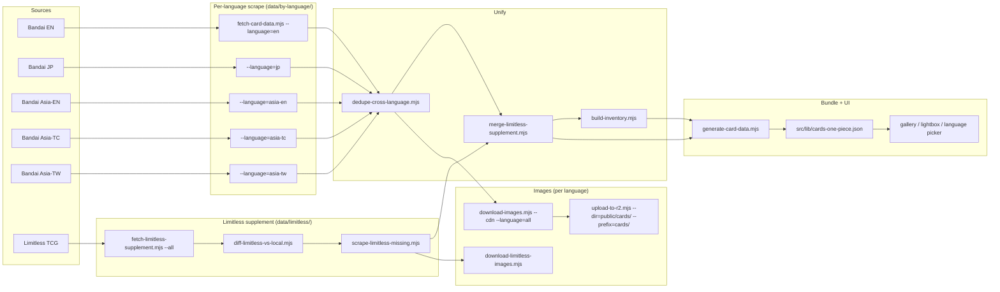

# One Piece TCG — Data Pipeline

This is the operator manual for the One Piece card pipeline. It documents
**every source we pull from**, **every script that runs**, **what each one
produces**, and **the exact commands to refresh the catalogue from scratch
or incrementally**.

Keep this file in sync with `scripts/*.mjs` when you change a source,
add a language, or rename an artifact. The pipeline scripts deliberately
read this layout (file names, directory names) and break loudly when it
drifts.

---

## 1. Sources

We pull from **two classes of source**: Bandai's first-party regional
cardlist sites (authoritative for everything they cover) and Limitless
TCG (community catalog used as a supplement for off-catalog promos and
stamped reprints).

### 1.1 Bandai regional cardlists

Every Bandai region serves the same HTML cardlist structure under
`/cardlist/`. The only differences are the host, the displayed
language, and which series each region has actually shipped yet.

| Region    | Host                              | `CardLanguage` tag | What it covers                                                                                       |
| --------- | --------------------------------- | ------------------ | ---------------------------------------------------------------------------------------------------- |
| EN        | `en.onepiece-cardgame.com`        | `EN`               | NA / EU English. Lags JP by ~6 months but is the canonical store of EN names + rules text.           |
| JP        | `www.onepiece-cardgame.com`       | `JP`               | The master Japanese catalogue. **Always** has the largest print count and ships first.               |
| Asia‑EN   | `asia-en.onepiece-cardgame.com`   | `EN_ASIA`          | English-language Asia distribution. Almost identical to EN but ships in parallel with JP timing.     |
| Asia‑TC   | `asia-tc.onepiece-cardgame.com`   | `TC`               | Traditional Chinese (Hong Kong / Macau distribution).                                                |
| Asia‑TW   | `asia-tw.onepiece-cardgame.com`   | `TW`               | Traditional Chinese (Taiwan distribution).                                                           |

Coverage gaps to know about:

- The Asia‑TC and Asia‑TW sites occasionally serve a **JP-art placeholder
  watermarked `SAMPLE`** for cards they haven't translated yet (typical for
  the older OP01–OP03 boosters). This is upstream behaviour — our pipeline
  records the URL faithfully and the UI shows what Bandai serves.
- Bandai's `asia-tw` site **silently ignores POST data** for series
  filtering. The scraper works around this by using GET requests with
  `?series=…` query strings universally across every region.
- Bandai publishes Korean at `onepiece-cardgame.kr` and Thai at
  `onepiece-cardgame.com.th`. Both are **out of scope** for Phase 7
  (Korean uses a totally different `OPK-XX` ID scheme; Thai is
  reachable but no user has asked for it). Plumbing them in later is
  ~1 day of work — add a `REGIONS` entry in `fetch-card-data.mjs`,
  a new `CardLanguage` enum value in `src/lib/types.ts`, and a
  picker bucket in `LANGUAGE_GROUPS`.

### 1.2 Limitless TCG (supplement)

`https://onepiece.limitlesstcg.com` is the de-facto community catalog.
It tracks everything Bandai publishes **plus** the long tail of promo
products Bandai forgets to add to `/cardlist/`:

- Illustration Box vols
- Premium Card Collections
- Championship celebration packs (Champion / Winner / Event stamps)
- Tournament prize cards
- Pre-release packs
- Magazine inserts

We treat Limitless as a **supplement, never a replacement**. When a
print exists in any Bandai region, Bandai's data wins (gameplay text,
images, name). Limitless only contributes prints Bandai doesn't list.

Politeness budget: 200 ms between requests, single-threaded. A full
crawl is ~17 min and is resumable (each category writes to disk
before moving on).

---

## 2. Pipeline DAG



---

## 3. Scripts (alphabetised)

Each script is **idempotent** and **safe to re-run**. Output paths
double as cache keys: re-running a step overwrites its artifacts
atomically (writes to `.tmp`, rotates to `.bak`, renames into place).

| Script                                  | Reads                                                              | Writes                                                                              | Notes                                                                                                              |
| --------------------------------------- | ------------------------------------------------------------------ | ----------------------------------------------------------------------------------- | ------------------------------------------------------------------------------------------------------------------ |
| `fetch-card-data.mjs`                   | Bandai region site HTML                                            | `data/by-language/<lang>.json`                                                      | `--language=` selects region; `--language=all` sweeps every region; `--language=legacy` keeps the old EN+JP merge. |
| `fetch-limitless-supplement.mjs`        | Limitless category pages                                           | `data/limitless/{categories,card-urls}.json`                                        | `--crawl` discovers; `--details` per-card; `--all` runs both.                                                      |
| `diff-limitless-vs-local.mjs`           | `data/limitless/card-urls.json`, every `data/by-language/*.json`   | `data/limitless/{missing-bases,missing-variants,known}.json`                        | Unions every Bandai region so "missing" really means missing everywhere.                                           |
| `scrape-limitless-missing.mjs`          | `data/limitless/missing-variants.json`                             | `data/limitless/missing-variants-detailed.json`                                     | Fetches full metadata (artist, product, subtitle, stamp keywords) for each row.                                    |
| `dedupe-cross-language.mjs`             | `data/by-language/*.json`, `data/limitless/missing-variants-detailed.json` | `data/cards.json` (.bak rotated)                                                  | Merges per-language rows by canonical print id, builds `imagesByLanguage` + `languages` + `exclusiveTo`.           |
| `merge-limitless-supplement.mjs`        | `data/cards.json`, `data/limitless/missing-variants-detailed.json` | `data/cards.json` (in place)                                                       | Injects Limitless-only prints with `source='limitless'` and classifies stamps (`winner`/`event`/`champion`/etc.).  |
| `build-inventory.mjs`                   | `data/by-language/*.json`, `data/cards.json`, `public/cards/**`     | `data/inventory.json`                                                              | Per-language card counts + per-print image hashes; the cache that lets weekly re-runs do delta-only work.          |
| `download-images.mjs`                   | `data/by-language/<lang>.json`                                      | `public/cards/<lang>/<printId>.png` (EN goes to flat `public/cards/<printId>.png`) | `--cdn --language=all` sweeps every region; `--zip` is an EN-only fast path.                                       |
| `download-limitless-images.mjs`         | `data/limitless/missing-variants-detailed.json`                     | `public/cards/<printId>.png`                                                       | Converts Limitless WebP → PNG on disk.                                                                             |
| `upload-to-r2.mjs`                      | `public/cards/<lang>/`                                              | `r2://<bucket>/cards/<lang>/<printId>.png` + `data/uploaded-<prefix-slug>.json`     | Skips files already in the marker; concurrent uploads.                                                             |
| `generate-card-data.mjs`                | `data/cards.json`, `data/packs.json`                                | `src/lib/cards-one-piece.json`, `src/lib/sets-one-piece.json`                      | Collapses per-print rows into `Card.variants[]` + `Card.imagesByLanguage`; emits R2 URLs for EN, raw Bandai URLs for non-EN until we mirror them. |

---

## 4. The refresh playbook

### 4.1 Daily / on-demand (10 min, no image downloads)

Use when you just want fresh **catalogue metadata** (new printings,
renamed products, fixed text) and don't care whether new image bytes
made it onto R2 yet.

```bash
node scripts/fetch-card-data.mjs --language=all          # ~4 min, polite scrape
node scripts/dedupe-cross-language.mjs                   # ~1s
node scripts/merge-limitless-supplement.mjs              # ~1s, idempotent
node scripts/build-inventory.mjs                         # ~5s, refreshes inventory.json
node scripts/generate-card-data.mjs                      # ~1s, rebuilds the UI bundle
```

The UI picks up the new bundle on the next dev / production build.
Cards introduced by this pass render their **Bandai source URL**
directly until a separate image-mirror sweep runs (next section).

### 4.2 Weekly / on new-product release (~45 min, full mirror)

When Bandai drops a new booster (or a Limitless category lands a
batch of stamped prints), run the full sequence:

```bash
# 1. Re-scrape every Bandai region
node scripts/fetch-card-data.mjs --language=all

# 2. Refresh the Limitless inventory and find new gaps
node scripts/fetch-limitless-supplement.mjs --all
node scripts/diff-limitless-vs-local.mjs
node scripts/scrape-limitless-missing.mjs

# 3. Rebuild the unified catalogue
node scripts/dedupe-cross-language.mjs
node scripts/merge-limitless-supplement.mjs

# 4. Mirror images (per-language, throttled to 2 req/s)
node scripts/download-images.mjs --cdn --language=all
node scripts/download-limitless-images.mjs

# 5. Push images to R2 (incremental; skips already-uploaded files
#    via data/uploaded-*.json markers)
node scripts/upload-to-r2.mjs                                       # EN root
node scripts/upload-to-r2.mjs --dir=public/cards/jp      --prefix=cards/jp
node scripts/upload-to-r2.mjs --dir=public/cards/asia-en --prefix=cards/asia-en
node scripts/upload-to-r2.mjs --dir=public/cards/tc      --prefix=cards/tc
node scripts/upload-to-r2.mjs --dir=public/cards/tw      --prefix=cards/tw

# 6. Refresh inventory + regenerate the bundle
node scripts/build-inventory.mjs
node scripts/generate-card-data.mjs
```

On a clean run nothing in step 4 / 5 downloads or re-uploads anything
that didn't change — `data/inventory.json` (image hashes) and
`data/uploaded-*.json` (R2 marker files) carry the previous state
forward.

### 4.3 First-time bootstrap (~2 h)

Same as 4.2 but with an empty `data/inventory.json`. Step 4 is the
long pole — five regions × ~4500 cards × 500 ms / req ≈ 90 min for
the polite Bandai sweep. Run it overnight.

---

## 5. Inventory contract (`data/inventory.json`)

`build-inventory.mjs` is the only writer; every other script may
**read** it to decide what to skip on the next pass. The shape is
deliberately small so that diff-friendly tools (`git diff`,
`jq`, code review) can spot real changes at a glance.

```jsonc
{
  "lastRunAt": "2026-05-21T13:40:56.721Z",
  "byLanguage": {
    "EN":      { "cards": 4371, "lastBandaiSync": "..." },
    "JP":      { "cards": 4518, "lastBandaiSync": "..." },
    "EN_ASIA": { "cards": 4470, "lastBandaiSync": "..." },
    "TC":      { "cards": 4471, "lastBandaiSync": "..." },
    "TW":      { "cards": 4471, "lastBandaiSync": "..." }
  },
  "byPrintId": {
    "OP05-062_p1": {
      "languages":   ["EN_ASIA", "TC", "TW"],
      "imageHashes": { "EN_ASIA": "sha256:…", "TC": "sha256:…", "TW": "sha256:…" },
      "imageBytes":  { "EN_ASIA": 312843,      "TC": 309541,      "TW": 308912    },
      "source":      "bandai",
      "stamp":       null,
      "lastSeenAt":  "2026-05-21T13:40:56.787Z"
    }
  }
}
```

Field semantics:

- **`byLanguage[lang].cards`** — number of rows in `data/by-language/<lang>.json`. The fetch script's diff report compares this against the new pull and refuses to overwrite when the new pull shrinks by >20% (`MIN_RETENTION_RATIO` in `fetch-card-data.mjs`).
- **`byPrintId[id].languages`** — every region that lists this print after dedupe. Drives the UI's `Card.languages` field.
- **`byPrintId[id].imageHashes[lang]`** — SHA-256 of the bytes we have on disk for that language. The download / upload scripts skip re-fetching and re-uploading when the hash matches the upstream byte stream.
- **`byPrintId[id].source`** — `"bandai"` when any Bandai region carries the print, `"limitless"` only when no Bandai region does. This is the single source of truth used to decide whether to mirror an image to R2 (Limitless prints stay on the Limitless CDN; we don't re-host their bytes).
- **`byPrintId[id].stamp`** — `"winner" | "event" | "champion" | "pre-release" | "pack" | null`. Classified by `merge-limitless-supplement.mjs` from Limitless's category metadata; used by the UI to badge tournament/prize variants distinctly.

### Adding a new source

To plug in another region or feed, register it in **three** places:

1. `scripts/fetch-card-data.mjs::REGIONS` — host + `CardLanguage` tag.
2. `src/lib/types.ts::CardLanguage` + `LANGUAGE_GROUPS` — picker bucket.
3. `scripts/build-inventory.mjs::FILE_TO_LANGUAGE` — inventory key.

Then re-run the playbook. The deduper / generator / UI pick up the
new language automatically by reading these three constants.

---

## 6. Schema invariants

- **Print id stability.** A print's id (`OP05-062`, `OP05-062_p1`, …) is invariant across languages. Multiple Bandai regions sharing the same id share the same artwork (with localized text overlays). The dedupe step refuses to merge prints whose ids disagree even when the image bytes look similar — that's a different print.
- **Bandai > Limitless.** When a print appears in *any* Bandai region, the Bandai row wins for gameplay metadata, image URLs, and `source='bandai'`. Limitless never overwrites a Bandai-sourced row.
- **Single `imageSmall` per card.** `Card.imageSmall` / `imageLarge` always hold the **EN R2** URL. Language-specific scans live exclusively in `Card.imagesByLanguage` and `print.imagesByLanguage`; the runtime filter swaps them in when the user picks a non-default language.
- **EN URL = R2.** EN images always go through our R2 mirror (`pub-…r2.dev/cards/<printId>.png`). Non-EN URLs are emitted as the raw Bandai region URL **until** that language's images are uploaded to R2 — see the comment in `generate-card-data.mjs::imageMapFor` for the swap-over plan.
- **`exclusiveTo` is a subset of `languages`.** A print is `exclusiveTo: ['JP']` only when `languages === ['JP']`. If the print ships in two regions it has no `exclusiveTo` field; the "exclusives" filter then excludes it.

---

## 7. Known limitations

- **No Korean / Thai.** Both are reachable from Bandai but Phase 7 deliberately scoped them out (KR has its own `OPK-XX` numbering that would need a separate id-mapping layer; Thai is the same schema as the existing scrapers but no user has asked for it).
- **No paid third-party APIs.** TCGplayer / Cardmarket would add price data but not images; deferred until pricing is on the roadmap.
- **No perceptual image hashing.** `data/inventory.json` does byte-level SHA-256 diffing. If Bandai silently re-uploads a print with a fixed text bubble at exactly the same bytes, we'd miss it. Adding perceptual hashing is a future enhancement.
- **No GitHub Action / cron.** By design — see top of file. Run the playbook manually when a new product drops.
- **`asia-tc` / `asia-tw` SAMPLE placeholders.** For older boosters Bandai serves the JP art with a `SAMPLE` watermark from the TC/TW CDN until they get around to translating each card. We surface the URL faithfully; there's no "real" TC art to pull until Bandai uploads it.

---

## 8. Quick reference

```bash
# What we currently have (per language)
jq '.byLanguage' data/inventory.json

# How many prints are EN-only / JP-only / CN-only
node -e '
  const d=require("./src/lib/cards-one-piece.json");
  const cs=Array.isArray(d)?d:(d.cards??[]);
  const tally={EN:0,JP:0,CN:0};
  for(const c of cs){
    const x=c.exclusiveTo||[];
    if(x.length===1&&x[0]==="EN")tally.EN++;
    else if(x.length===1&&x[0]==="JP")tally.JP++;
    else if(x.length>0&&x.every(l=>["TC","TW"].includes(l)))tally.CN++;
  }
  console.log(tally);
'

# Which prints did Limitless add on top of Bandai's catalog?
jq '[.byPrintId | to_entries[] | select(.value.source=="limitless") | .key]' data/inventory.json
```
