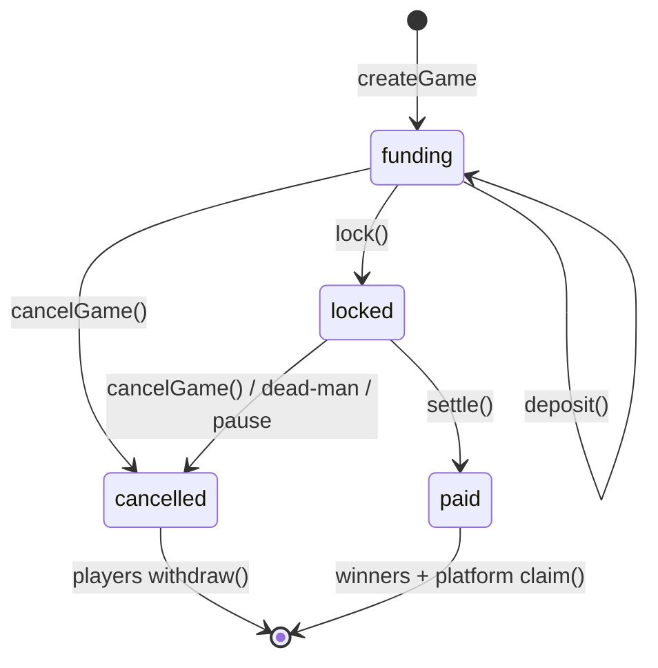

# Paid Tournaments (Base USDC escrow)

> Status: IN PROGRESS. This is the full architecture for adding paid-entry
> tournaments to The Card Wall, with a smart contract acting as the trustless
> custodian for entry fees, prize payouts, and the platform rake. Everything
> here is agreed and locked unless a section says otherwise.
>
> Implementation progress (build plan, section 13):
>
> - **Phase 1 (done)** - the escrow contract + tests live in `contracts/`
>   (`TournamentEscrow.sol`, 54 Foundry tests, ~96% line coverage, proxy Deploy
>   + Upgrade scripts). Not yet deployed; deploy to Base Sepolia first.
> - **Phase 2 (done)** - DB migration `supabase/migrations/020_paid_tournaments.sql`
>   (note: the section 8.1 filename `009_...` predated the real numbering), the
>   on-chain reader `src/lib/tournament/escrow.ts` (env-gated, read-only), the
>   deposit-verify route `POST /api/tournaments/:code/deposit-verify`, and the
>   read-only reconcile pass folded into the hourly cron sweep.
> - **Phase 3 (todo)** - the `/tournaments/play` lobby, the deposit step UX, and
>   wiring the admin Create/Lock/Settle buttons to wallet-signed txs (add Base
>   to the wagmi config, which is mainnet-only today).
> - **Phase 4/5 (todo)** - mainnet pilot, then audit + Safe multisig.

Related reading:

- `docs/tournaments.md` - the existing (free) tournament feature this builds on.
- `docs/future-build.md` - the earlier anti-gaming / soft-security notes.
- Wallet auth lives in `src/lib/wallet/*` and `src/app/api/auth/*` (SIWE).

---

## 1. What this is and why

Today `/tournaments` runs free events and the operator (you) pays prizes out of
pocket. This feature lets players fund the prize pool themselves via paid entry,
lets the operator take a platform rake, and hands custody of the money to a
smart contract so nobody has to trust the operator to hold funds honestly.

The pitch, end to end:

1. A player opens a lobby of open paid games (v1: a single $10 tier, many games
   running in parallel).
2. They sign up with their wallet (the existing SIWE flow), the operator vets
   and approves them, and only then can they deposit their $10 entry in USDC on
   Base.
3. When the operator has approved and funded enough players, they manually lock
   the game and run it exactly as they run free tournaments today.
4. When it finishes, the operator submits the final placement order. The
   contract computes the split, pays the top places, and sends the operator a
   15% rake.

The contract guarantees the money can only ever go to real participants, the
rake can never exceed the cap, and funds can always be refunded if anything
goes wrong.

---

## 2. Design principles and constraints (v1)

These are deliberate simplifications to keep the MVP lean and reliable.

- **Base only. USDC only.** Native Circle USDC on Base
  (`0x833589fCD6eDb6E08f4c7C32D4f71b54bdA02913`), never the bridged USDbC.
  No cross-chain, no relay.link, no multi-asset for v1. "Any token in" is a
  later on-ramp that does not touch the contract.
- **Trusted operator, single resolver.** You are the sole operator and the sole
  party who declares winners. The contract constrains what you can do with the
  money, but it trusts you to report results honestly (see the oracle note in
  section 3).
- **Manual everything.** Creating a game, locking it, and settling it are all
  admin-panel actions. No auto-kickoff, no automated settlement. The existing
  hourly cron sweep does read-only reconciliation only and never moves money.
- **Approve-then-pay.** A player can only deposit after the operator approves
  their entry, so rejected players never have to be refunded.
- **The chain is the source of truth for money.** Supabase mirrors on-chain
  state; on any disagreement the chain wins.

---

## 3. Trust model and the oracle reality

A smart contract cannot know who won a card game. Results in this app are
self-reported off-chain and can be overridden by the host (see the match state
machine in `docs/tournaments.md`). So a trusted party has to tell the contract
who won. That party is you.

This is **not fully trustless**, and that is fine for v1. The contract still
meaningfully constrains the operator, which is the real improvement over "the
host holds everyone's money in their own account":

- The rake is capped in code and can never exceed the cap.
- Winners must be actual funded depositors of that specific game.
- The payout amounts are computed by the contract from the locked split, not
  supplied by the operator.
- The operator cannot touch funds mid-game.
- If the operator never settles, players can always self-refund (dead-man
  switch, section 7).
- A global emergency stop can refund everyone at once.

Future upgrade path (not v1): optimistic settlement with a player dispute
window, so a challenged result escalates instead of being final. The storage is
designed so this can be added later without a rewrite.

---

## 4. Actors and roles

| Actor | On-chain identity | Powers |
| --- | --- | --- |
| Operator (you) | Your connected wallet (same SIWE wallet) | createGame, lock, settle, cancelGame, refundPlayer, pause/unpause, upgrade |
| Player | Their wallet (enroll wallet == deposit wallet == payout wallet) | deposit, withdraw (refund), claim (winnings) |
| Platform | A payout address (EOA now, Safe multisig later) | Receives the 15% rake, claims it like a winner |
| Upgrade authority | EOA now, Safe multisig later | Authorizes UUPS upgrades |

For v1 the operator, platform, and upgrade authority can all be the same wallet.
Splitting them onto a Safe multisig is a later hardening step that needs no
contract change.

---

## 5. Two-layer UX

> **Locked decision (2026-07-29): paid tournaments are a SEPARATE, always-on
> surface. The existing `/tournaments` page, operator setup flow, admin panel,
> and "past events" stay exactly as they are - they remain the home of curated
> *featured* events (one live event at a time, operator-funded prizes). The paid
> Web3 flow is a NEW page that copies the visual style but runs independently:
> many games in parallel, always available, self-sustaining. The two share the
> underlying tournament *engine* (pairing, matches, reporting, scheduling) but
> are distinct *pages/UX*.**

Concretely:

- **Featured events** (unchanged): `/tournaments` shows the single `is_live`
  event and its full existing flow. No paid logic leaks into this page.
- **Paid lobby** (new, e.g. `/tournaments/play`): always available; lists open
  paid games. For v1 this is simply "here are the open $10 games". A player can
  join multiple games in parallel. Each card shows the entry fee, the payout
  structure, current funded count vs cap, and a Join button.
- **Paid game page** (new route under the paid surface, reusing the bracket /
  reporting / scheduling components): once locked, the game runs on the same
  engine as featured events.

A paid game is just a tournament row with `escrow_id` set and `is_live = false`,
so it is invisible to the featured-event page by construction. Because a player
row is already per-tournament, one player being in several paid games at once is
free. Each game is a separate on-chain escrow instance.

---

## 6. Money flow

```
Player USDC (Base) --deposit()--> Escrow contract (per-game pot)
                                     |
                    operator lock() + run tournament off-chain
                                     |
                    operator settle(orderedWinners)
                                     |
        contract credits winners (top N) + platform (15% rake)
                                     |
              winners + platform claim() --> their wallets
```

Refund path (any failure): `cancelGame` / global `pause` / dead-man timeout
makes the game refundable, and each player calls `withdraw()` to pull their full
entry back (no rake taken on refunds).

---

## 7. The smart contract

A single UUPS-upgradeable escrow contract on Base, holding many games at once,
keyed by a `bytes32` game id that mirrors the Supabase tournament id.

### 7.1 Per-game state

Each game stores:

- `entryFee` (USDC, 6 decimals) - $10 = `10_000000` for v1, stored per game so
  multi-tier is free later.
- `cap` - maximum funded players.
- `rakeBps` - basis points, 1500 = 15%, validated `<= MAX_RAKE_BPS`.
- `payoutBps[]` - the locked split of the post-rake prize pool (sums to 10000).
- `pot` - running balance of collected entries.
- `funded` set - which addresses have paid, one entry per address.
- `state` - funding | locked | paid | cancelled.
- `lockedAt` - timestamp that starts the dead-man clock.
- internal `credits` - pending pull balances for winners and the platform.

### 7.2 Lifecycle



A global `paused` flag overlays all games: while paused, no settlement can
occur and every active game becomes refundable.

### 7.3 Functions (interface sketch, not final Solidity)

Operator:

- `createGame(id, entryFee, cap, rakeBps, payoutBps[])` - opens a game.
  Validates `rakeBps <= MAX_RAKE_BPS` and `sum(payoutBps) == 10000`.
  State -> funding.
- `lock(id)` - freezes the roster (no more deposits), records the final
  depositor set, freezes the payout structure, starts the 14-day dead-man
  clock. Guard: rejects if `funded count < payout depth` (cannot run a top-8
  payout on 6 players). State -> locked.
- `settle(id, orderedWinners[])` - operator passes only the ordered winner
  addresses (1st, 2nd, 3rd, ...). The contract computes each amount from the
  locked split and the pot, validates every winner is a distinct funded
  depositor, then credits winners and the platform. State -> paid.
- `cancelGame(id)` - makes a game refundable before settlement. State ->
  cancelled.
- `refundPlayer(id, player)` - pre-lock single-player kick and refund (caught a
  cheater or a bad entry after they paid but before start).
- `pause()` / `unpause()` - global emergency stop / resume.
- `_authorizeUpgrade(...)` - UUPS upgrade gate, restricted to the upgrade
  authority.
- `rescueStrayTokens(...)` - recovers tokens sent directly to the contract (not
  via deposit); can never touch tracked game pots.

Player:

- `depositWithPermit(id, permit)` - one transaction. An off-chain EIP-2612 USDC
  permit signature authorizes the pull; the contract collects exactly
  `entryFee` and marks the sender funded. Rejected if the game is full, locked,
  cancelled, or globally paused. One deposit per address per game.
  (A plain `deposit(id)` after a separate `approve` is the fallback if permit
  is ever unavailable.)
- `withdraw(id)` - pull a full refund, allowed only when the game is cancelled,
  globally paused, or the dead-man window has elapsed on a locked-but-unsettled
  game. Marks the player refunded so they cannot double-withdraw.
- `claim(id)` - winners and the platform pull their credited balance after
  settlement.

Views: game state, pot size, per-player funded / refunded / claimable status.
Used by the backend to verify deposits and drive the lobby and admin panel.

### 7.4 Payout presets

The operator picks a preset at `createGame`; it locks at `lock()`. Percentages
are of the **post-rake** prize pool and sum to 100. Dust from integer rounding
(USDC has 6 decimals) is folded into 1st place so the pot always distributes to
the cent.

| Preset | Split |
| --- | --- |
| Winner-take-all | 100 |
| Top-3 | 50 / 30 / 20 |
| Top-6 | 40 / 22 / 14 / 10 / 8 / 6 |
| Top-8 | 33 / 20 / 14 / 10 / 8 / 6 / 5 / 4 |

Guidance (soft, warn in admin UI): only offer a preset when the locked field is
comfortably larger than the payout depth (for example top-8 for 16+ players),
otherwise lower places round down to near-nothing after the rake.

### 7.5 Worked example

16 players x $10 = **$160 pot**, top-8 preset:

- Rake 15% -> **$24** to platform.
- Prize pool **$136**, split 33/20/14/10/8/6/5/4:
  - 1st $44.88, 2nd $27.20, 3rd $19.04, 4th $13.60, 5th $10.88, 6th $8.16,
    7th $6.80, 8th $5.44 (sums to exactly $136).

### 7.6 Invariants the contract guarantees

1. **Per-game isolation.** A game's payout can never exceed its own pot; games
   cannot touch each other's money. This is the highest-priority thing to test.
2. **Exactly one exit for every deposit.** Funds leave via settle -> claim
   (winners + platform) or via withdraw (refunds). Nothing can get stuck; the
   dead-man switch guarantees it.
3. **Rake capped, and only on success.** `rakeBps <= MAX_RAKE_BPS`, and rake is
   taken only on settlement, never on refunds.
4. **Settle is once-only, post-lock-only, to distinct funded depositors, with
   contract-computed amounts.**
5. **A player is never both paid and refunded** for the same game.
6. **Exact entry, one per address.** No partial or double deposits.

### 7.7 Safety mechanisms

- **Per-game dead-man switch.** If a locked game is not settled within 14 days
  of `lock`, its players can self-`withdraw` their full entry. Protects against
  a lost key or an abandoned game.
- **Global emergency stop.** `pause()` halts all settlements and makes every
  active game refundable. The platform-wide big red button.
- **UUPS upgradeability.** Lets you fix bugs. Tradeoff: the upgrade key can
  change contract logic, including money paths, so move it behind a Safe
  multisig once real funds flow. Watch storage-layout compatibility on every
  upgrade.
- **Pull-based payouts.** `settle` credits balances and recipients `claim`
  them, rather than pushing USDC. If one recipient address were blacklisted by
  USDC or otherwise un-payable, a push would revert and brick settlement for
  everyone; crediting isolates that failure to the one address.

---

## 8. Off-chain integration

### 8.1 Database (new migration, e.g. `supabase/migrations/009_paid_tournaments.sql`)

`tournaments` gains:

- `escrow_id` (bytes32/text) - the on-chain game id.
- `entry_fee_usdc` (int, 6-decimal units).
- `rake_bps` (int).
- `payout_preset` (text) or `payout_bps` (jsonb).
- `contract_address` (text), `chain_id` (int).
- new statuses in the existing status column: `funding`, `locked`, `settling`,
  `paid`, `cancelled` (layered onto the current lifecycle).

`players` gains:

- `deposit_tx` (text) - the confirmed deposit transaction hash.
- `funded` (bool) - true only after the deposit is confirmed on-chain.
- `refunded` (bool).

The wallet binding already exists: `players.walletAddress` is stamped at enroll
(`src/app/api/tournaments/[code]/enroll/route.ts`). Enforce
`enroll wallet == deposit wallet == payout wallet`.

### 8.2 API routes (new, under `src/app/api/tournaments`)

- **Deposit verify** - given a deposit tx, confirm on-chain (after ~10 Base
  confirmations) that the right wallet paid the right game the exact fee, then
  set `funded = true`. The bracket only ever includes funded players.
- **Reconcile (in the existing cron sweep)** - read-only pass that reads
  on-chain deposits and game state and repairs the `funded` / `refunded` flags
  in Supabase. Idempotent, chain-wins. The cron never signs or moves money.
- **Settle (admin)** - computes the ordered winners from the final standings and
  returns the numbers to the admin panel. The panel then asks the operator's
  wallet to sign the `settle` transaction (see 8.4). The server holds no
  signing key.

Everything else (pairing, reporting, scheduling, overrides) is unchanged.

### 8.3 The funded gate

The current "close enrollment -> generate round 1" keys off signups. In the
paid model it must key off **confirmed deposits only**. No deposit, no seat.
`lock` on-chain and bracket generation off-chain both operate on the funded set.

### 8.4 Settle signing (no hot key)

The payout key never lives on the server. Flow:

1. Tournament finishes; backend computes the ordered winners.
2. Admin panel shows a Settle button with the resolved placement and amounts.
3. Operator clicks; their connected wallet (the same one used for SIWE sign-in)
   pops up to sign the `settle` transaction on Base.
4. Winners and the platform later `claim`.

The operator has to be present to click, which is already true because every
game is run manually.

---

## 9. End-to-end sequence

1. Operator calls `createGame` (admin panel signs the tx). Supabase row created
   with `escrow_id` and `status = funding`.
2. Player signs in (SIWE), enrolls, submits deck + region. Row is `pending`.
3. Operator approves the player. The deposit button unlocks.
4. Player deposits $10 via `depositWithPermit` (one tx). Backend waits ~10
   confirmations, verifies, sets `funded = true`.
5. Repeat until the operator has enough approved, funded players.
6. Operator calls `lock` (admin panel signs). Bracket is generated from the
   funded set. `status = locked`. Dead-man clock starts.
7. Tournament runs on the existing flow (reporting, scheduling, overrides).
8. Operator resolves final standings, including Swiss tiebreakers, off-chain.
9. Operator clicks Settle; wallet signs `settle(orderedWinners)`. Contract
   computes and credits payouts + rake. `status = paid`.
10. Winners and platform `claim` their USDC.

Refund variants: if a game never fills, operator `cancelGame` and players
`withdraw`. If something breaks platform-wide, operator `pause` and everyone
`withdraw`. If the operator disappears after lock, players `withdraw` after the
dead-man window.

---

## 10. Security considerations

- Use audited building blocks (OpenZeppelin), a reentrancy guard, and
  checks-effects-interactions. Pull-over-push for all outgoing USDC.
- Test per-game fund isolation hardest; a cross-game accounting bug is the worst
  case.
- Wait ~10 Base confirmations before marking a deposit funded so a reorg cannot
  seat an unpaid player.
- Native USDC is pausable/blacklistable by Circle; pull payouts contain the blast
  radius if a recipient is ever blacklisted.
- Move the operator/upgrade/platform authority to a Safe multisig before scaling
  real volume.
- Players need a small amount of Base ETH for gas (deposit, withdraw, claim) in
  v1. Gas sponsorship (paymaster) is a later polish.
- Get the contract audited before it holds meaningful real money.

---

## 11. Locked parameters

| Parameter | Value |
| --- | --- |
| Chain | Base |
| Settlement asset | Native Circle USDC (`0x8335...2913`) |
| Entry tier (v1) | $10 (stored per game; multi-tier later) |
| Rake | 15%, off the top, before the split; capped in code |
| Payout presets | winner-take-all, top-3, top-6, top-8 (section 7.4) |
| Format | Swiss, sizes 8/16/32/64 by convention |
| Kickoff | Manual `lock` by operator (no auto-cutoff) |
| Sign-up order | Approve-then-pay |
| Deposit | EIP-2612 permit, exact fee, one per address |
| Settle signing | Operator's connected wallet (no server key) |
| Payouts | Pull-based `claim` |
| Contract | UUPS upgradeable |
| Dead-man timeout | 14 days from lock |
| Confirmations before funded | ~10 Base blocks |

---

## 12. Deferred / not in v1

- Multi-asset "any token in" via relay.link (on-ramp only, no contract change).
- Additional entry tiers ($20/$30/$50...).
- Player-created paid games (v1 is operator-created only).
- Gas sponsorship / paymaster so players need no Base ETH.
- Optimistic settlement with a dispute window.
- Safe multisig for operator / upgrade / platform keys (start EOA).
- Any KYC / tax reporting / legal review (explicitly out of scope for now per
  the current decision; revisit before scaling or opening to US retail).
- Auto-kickoff at a threshold and automated settlement.

---

## 13. Build plan

1. Write and unit-test the contract; deploy to **Base Sepolia**. Cover isolation,
   refunds, dead-man, pause, and the full settle math.
2. Add the DB migration and the deposit-verify + reconcile plumbing.
3. Build the lobby and the deposit step; wire the admin panel Create / Lock /
   Settle buttons to wallet-signed transactions.
4. Run a tiny real-money pilot on Base mainnet (for example a $1 entry with
   friends) before enabling the $10 tier.
5. Audit before any real volume; then move keys to a Safe.

---

## 14a. Autopilot + hard-deadline match resolution

Paid games run themselves once the operator starts the bracket. The only manual
steps are: spin up the game, approve/reject applicants, start the bracket, and
settle discrepancies. Everything else is automated by the hourly cron sweep
(`enforceRoundDeadlines` in `service.ts`), scoped to paid (escrow-linked)
tournaments so featured events keep their softer, extendable behavior.

**Hard round deadline (no extensions).** Each round has a fixed `ends_at`
(`round_minutes` from `lock`/start). When it elapses, the sweep force-resolves
every unfinished match in that round and advances. There is no "add time" for
paid games.

**Resolution policy - designed so stalling never helps** (the anti-gaming core):

- **One player reported, the other ghosted** -> the reporter's result stands
  (the single-sided report already stored a provisional winner). So if your
  opponent won't schedule or goes quiet, you report your result and it sticks.
- **Neither reported by the deadline** -> **double forfeit**: both take a loss
  (0 points), counted as a played game that drags each player's tiebreakers.
  Because a no-show is a guaranteed loss for *both*, a player can never improve
  their odds by dragging a match out to force a random result. There is no coin
  flip and no "better record advances" (both were gameable).
- **Both reported but disagree** -> **disputed**: the one case that pauses
  autopilot. The round will not advance until the operator settles it
  (`set-result`).

This is why paid games are **Swiss only**: no elimination, a double loss is a
clean, non-advancing outcome, and the champion falls out of the final Swiss
standings + existing tiebreakers (points, OMW, head-to-head, OOMW). The
`double_forfeit` match status is tallied as a loss for both players in
`pairing.ts` (never a draw).

Implementation: `MatchStatus` gains `double_forfeit`; `tallyMatches` counts it
as a mutual loss; `roundFullyResolved` treats it as resolved;
`enforceRoundDeadlines` runs in `sweep()` and is a no-op for featured events.

**On-chain autopilot (money side).** The backend drives the whole money
lifecycle with a least-privilege `operator` key (see the contract's operator
role), so no human signs anything after starting a game:

- `adminCreatePaidGame` -> `createGame` on-chain (operator-signed) before the DB
  row is written, so the mirror and contract never diverge.
- Bracket start (`generateFirstRound`, paid only) -> `lock` on-chain, freezing
  the funded roster + payout and starting the 14-day dead-man clock.
- Completion (`finalizeTournament`, paid only) -> `settle` on-chain: the top
  `payoutBps.length` finishers by final standings are mapped to their funded
  wallet addresses and submitted; the contract computes amounts, credits winners
  + the 15% rake, and everyone pulls with `claim`. `reconcilePaidSettlements` in
  the sweep retries any complete-but-unsettled game (idempotent - it only acts
  when the on-chain state is still `Locked`).

Custody: there is ONE contract escrowing every game at once (per-game `bytes32`
isolation) - no per-tournament wallets. Three roles: `owner` (cold multisig:
upgrade/pause/rescue), `operator` (hot backend key: create/lock/settle),
`platform` (rake recipient). A leaked operator key cannot drain funds to an
outside address because `settle` only pays real entrants and refunds only return
to depositors. This whole path is gated on `TOURNAMENT_ESCROW_OPERATOR_KEY`;
unset -> on-chain writes are skipped (DB-only QC mode) and settle is manual.

Everything is verified locally: `contracts/test/Stress.t.sol` runs many
concurrent games through the operator key and asserts contract balance always
equals `usdcObligations` and fully drains to zero (256-run fuzz).

## 14b. Multiple simultaneous games + creation

Paid games are created with `adminCreatePaidGame` (admin action
`create-paid-game`). They set `escrow_id` + `is_live = false`, so:

- Many can run at once (the operator opens new lobbies anytime); the always-on
  `/tournaments/play` lobby lists all open ones.
- They never appear on / interfere with the single featured event at
  `/tournaments`.

Enrollment has no signup timer - it stays open until the operator starts the
bracket, mirroring "manual start". Approve-then-pay and the funded gate still
apply once the escrow is deployed and configured.

## 14. Glossary

- **Rake** - the platform fee (15%), taken off the pot before the prize split.
- **Prize pool** - the pot minus the rake; what the payout presets divide.
- **Funded** - a player whose on-chain deposit is confirmed; only funded players
  make the bracket.
- **Lock** - freezing a game's roster and payout structure and starting play.
- **Settle** - submitting the final placement so the contract pays out.
- **Dead-man switch** - the timeout that lets players self-refund if a locked
  game is never settled.
- **Pull payout** - the contract credits a balance and the recipient withdraws
  it, instead of the contract pushing funds.
- **UUPS** - an upgradeable-proxy pattern where upgrade logic lives in the
  implementation contract.
